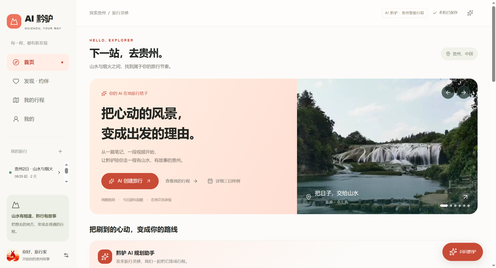
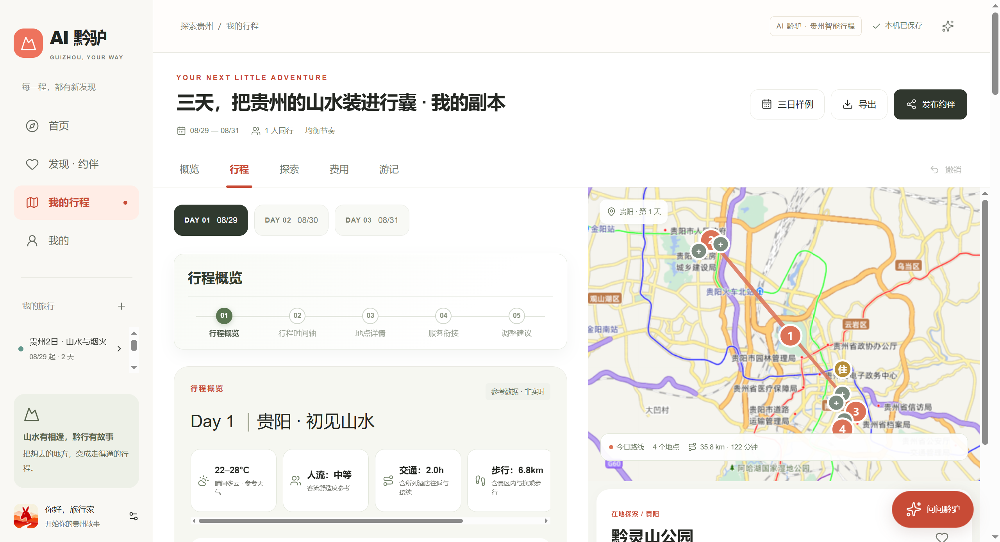
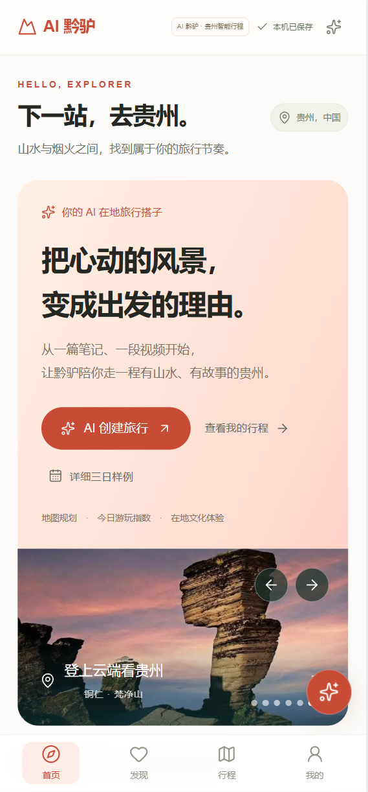
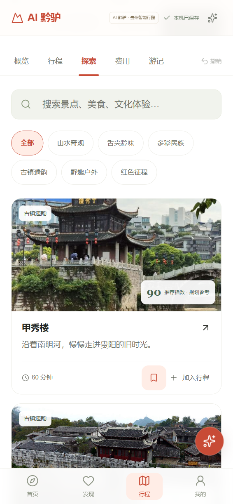
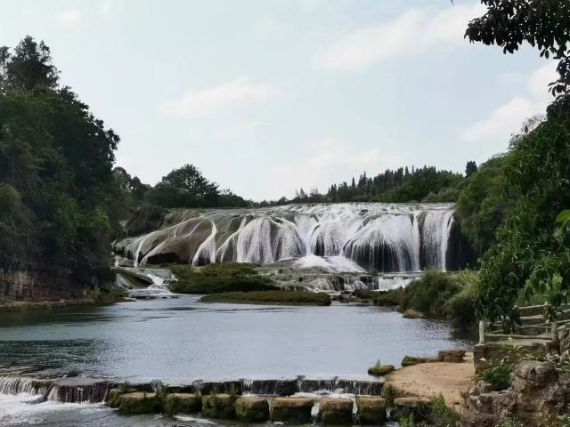
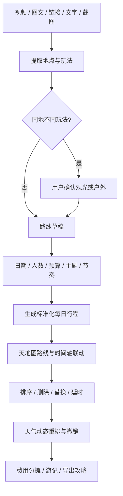

<div align="center">


# AI 黔驴 · 贵州智能旅行规划

**把刷到的旅行灵感，整理成真正可编辑、可调整、可导出的贵州行程。**

<p>
  <a href="https://react.dev/"></a>
  <a href="https://www.typescriptlang.org/"></a>
  <a href="https://vite.dev/"></a>
  <a href="https://tailwindcss.com/"></a>
  
</p>

[GitHub 仓库](https://github.com/CodeGanHaoZ/TarvelGuIYANG) · [产品需求](docs/requirements.md) · [技术架构](docs/architecture.md) · [视觉规范](docs/design.md) · [交通资料边界](docs/TRANSPORT_SOURCES.md)

</div>

## 项目介绍

AI 黔驴是一套面向贵州旅行场景的交互式行程规划 Demo。用户可以从旅行视频、图文攻略、链接、文字描述或截图开始，提取想去的地点，再生成标准化的每日行程；生成后不是一段静态攻略，而是一份可以继续拖动、删除、替换、延时、切换交通和按天气重排的旅行计划。

产品重点解决贵州旅行中的四类典型问题：

- **景区跨度大**：突出景区之间的交通时间，避免只看直线距离做决定。
- **山地步行耗时**：同时展示步行距离、预计用时与休息建议。
- **景区接驳复杂**：区分景区间交通、入口步行、观光车与内部步道，并提供真实地图入口。
- **天气影响明显**：支持模拟天气变化后的路线确认与一键撤销。

桌面端为侧栏 + 时间轴 + 地图工作台布局；手机端为四个底部入口 + 上地图、下行程布局，并对长列表、时间轴、弹窗做了专门的移动端适配。

## 界面预览

<table>
  <tr>
    <td width="50%">
      
      <p align="center"><b>首页 · 社交灵感与主题入口</b><br/><sub>视频 / 图文轮播、六类主题 3×2 网格、AI 规划对话框</sub></p>
    </td>
    <td width="50%">
      
      <p align="center"><b>行程页 · 时间轴与地图工作台</b><br/><sub>每日时间轴、拖拽排序、天地图路线、GoScore</sub></p>
    </td>
  </tr>
  <tr>
    <td width="50%">
      
      <p align="center"><b>H5 · 首页与底部导航</b><br/><sub>底部四入口、滚动揭示动效、分批加载</sub></p>
    </td>
    <td width="50%">
      
      <p align="center"><b>H5 · 探索目的地</b><br/><sub>首屏 10 条，滚动到底部分批追加，新卡片逐张滑入</sub></p>
    </td>
  </tr>
</table>

## 贵州主题视觉

<table>
  <tr>
    <td width="33%"></td>
    <td width="33%"></td>
    <td width="33%"></td>
  </tr>
  <tr>
    <td align="center"><b>山水奇观</b><br/>瀑布、喀斯特与峡谷</td>
    <td align="center"><b>山地路线</b><br/>步行、游船与天气方案</td>
    <td align="center"><b>多彩民族</b><br/>村寨、歌舞与非遗体验</td>
  </tr>
</table>

平台采用六类互斥主题组织内容，避免把同一地理名称下完全不同的玩法混在一起：

| 主题     | 核心体验                   | 代表内容                           |
| -------- | -------------------------- | ---------------------------------- |
| 山水奇观 | 以观赏、摄影为主           | 黄果树、小七孔、天星桥             |
| 舌尖黔味 | 以饮食场景为主             | 酸汤鱼、丝娃娃、肠旺面             |
| 多彩民族 | 少数民族活态文化互动       | 西江苗寨、蜡染与银饰               |
| 古镇遗韵 | 汉族历史、屯堡和商埠       | 青岩古镇、天龙屯堡                 |
| 野趣户外 | 徒步、漂流等体力体验       | 梵净山徒步、马岭河峡谷             |
| 红色征程 | 革命旧址和纪念场所         | 遵义会议会址                       |

## 核心亮点

### 1. 全站滚动动效体系（最新）

新增 `ScrollReveal` 组件，基于 IntersectionObserver + MutationObserver 实现声明式滚动入场动画：

- **三种揭示模式**：单元素淡入上滑、容器子项错落入场、长列表逐项观察（时间轴 / 探索列表）。
- **弹窗三级动画**：遮罩淡入、面板弹入、内容错落滑入，替代原生的生硬出现。
- **返回顶部联动**：点击返回顶部并滚动到位后自动重置动画，再次下滑时重新播放。
- **兜底机制**：双 rAF 主动检测视口内元素，修复 tab 切换 / 条件渲染时 IO 回调不触发导致的“内容不显示”问题。
- 全部动效尊重系统 `prefers-reduced-motion` 设置。

### 2. H5 端体验优化（最新）

- **探索列表滚动分批加载**：首屏 10 条，滚动到底部附近自动追加下一批，带加载指示器，新卡片逐张滑入。
- 移动端底部四入口导航、上地图下行程布局。
- 时间轴步骤条连接线在横向滚动下保持完整（每项独立绘制连接线）。
- 收藏操作升级为按钮交互，并附带收藏 / 取消提示。

### 3. 从内容生成行程

- 首页横向轮播 6 条演示视频与 6 篇图文（六类主题各一），支持触摸滑动、触控板、方向键，不自动轮播。
- 打开内容详情可保留地点、时间码、推荐依据与原始来源；多篇内容可加入灵感篮合并去重。
- “成为我的出行规划”进入标准化规划流程，而不是生成一段不可编辑的文本。
- 视频通过 B 站播放器嵌入原始页面，图文为站内编辑整理；账号与互动数为虚构演示数据。

### 4. AI 规划对话框与本机 OCR

- 支持输入文字、添加链接、选择 / 粘贴 / 拖入截图（每批 3 张、每张 8 MB，JPG/PNG/WebP）。
- 截图使用 Tesseract.js 7 + 中英文语言包在浏览器本机识别，不上传图片字节、不依赖外部 CDN。
- 识别结果可核对 OCR 全文、查看推荐指数、移除地点，并支持“再加甲秀楼”“不去青岩古镇”等规则指令继续修改。
- 未知外链不抓取、不返回无关路线；天数 / 人数 / 预算 / 节奏等参数可从对话带入行程创建。

### 5. 标准化每日行程

- 内置贵阳、荔波、黔东南三套三日样例，合计 42 个地点、31 个停靠点；每站含建议时间、停留、具体玩法与提示，每天含用餐、住宿区域与预算分类。
- 时间轴支持拖拽排序、上下移动、删除、替换、延长 30 分钟、添加地点；任意调整后自动重算后续时间、交通与费用汇总。
- 空白行程有明确的“填入样例”入口，非空行程不会被自动覆盖。
- 修改结果保存在浏览器 `localStorage`，刷新后可继续编辑，并支持一键撤销上一次修改。

### 6. GoScore 可解释推荐指数

每个地点展示可解释的推荐指数，展开可查看每个因子、品类特征与权重；闭园、到达过晚或天气不适合高风险户外时，推荐结果会被限制，不会被其他高分因素抵消。分数均为 Mock，不代表官方评价。

### 7. 地图能力

- **行程页地图（`route-map.tsx`）**：默认接入天地图真实底图（矢量 + 影像），展示编号标记、路线折线与缩放控件，未配置 Key 时回退内置演示 Key / 示意图；同时支持百度 BMapGL 底图与高德标记链接。
- **两级地图组件（`guizhou-route-map.tsx`）**：基于百度地图 JSAPI 的省域 + 景区内部两级交互地图，含黄果树内部导览点位（入口、观光车、观景台、服务点）与逐站游览模式。
- **外部路线入口**：交通方案提供带起终点、交通方式参数的高德 / 百度地图查询链接，由用户在官方 App 内核对，结果不自动回填。
- 坐标统一声明为 GCJ-02 近似值；未接入实时路线 Web Service 前，本站里程与分钟数为规划估算。

### 8. 交通方案比较

点击时间轴两站之间的连线或「交通方案与线路查询」，可按路段比较步行、驾车 / 打车、公交地铁 / 高铁接驳参考，支持按时间、总费用、换乘和步行量排序；跨城日期自动把上日尾站至今日首站的接续交通纳入计算。选择方案会同步更新时间轴、地图摘要、当天费用与 Markdown 导出。未知公交不编造线路号、时间或换乘数。

## 用户流程



## 技术架构

| 层级     | 技术与职责                                                         |
| -------- | ------------------------------------------------------------------ |
| 前端     | React 19、TypeScript 5.9、Vite 8、Vinext 路由外壳                 |
| UI       | Tailwind CSS 4、Base UI / shadcn 风格组件、Lucide 图标、响应式 CSS |
| 地图     | 天地图 JSAPI、百度地图 JSAPI、高德 / 百度 URI 链接、GCJ-02         |
| 规划规则 | 本地数据模型、时间轴、GoScore、预算、优化与重排规则                |
| 内容识别 | Tesseract.js 7 本机 OCR，中英文语言包，无 CDN、无上传              |
| 动效     | ScrollReveal（IntersectionObserver + MutationObserver）、CSS 动画  |
| 状态存储 | 浏览器 localStorage；Service Worker 按需缓存静态资源               |
| 部署     | Docker + GHCR 工作流、CloudBase standalone、Cloudflare Worker      |
| 质量     | Node Test Runner、TypeScript、Oxlint、Oxfmt                        |

## 项目结构

```text
app/
  travel-app.tsx                 页面、交互编排与设备本地状态
  globals.css                    主题 tokens、桌面及移动布局、动效样式
  layout.tsx                     根布局（挂载全局 ScrollReveal）
components/
  scroll-reveal.tsx              滚动揭示动效（三种模式 + 重置 + 兜底）
  back-to-top.tsx                返回顶部（到位后重置揭示动画）
  route-map.tsx                  行程页地图（天地图 / 百度 / 示意回退）
  guizhou-route-map.tsx          省域 + 景区两级百度地图（黄果树导览）
  social-inspiration.tsx         视频图文轮播、灵感篮与收藏
  social-content-page.tsx        /inspiration/:id 独立内容页
  inspiration-planner.tsx        首页 AI 规划对话框与 OCR 整理
  trip-wizard.tsx                三步创建与生成状态
  day-brief.tsx                  每日概览和同行设置
  day-event.tsx                  时间轴交通 / 餐饮事件
  go-score.tsx / recommendation-score.tsx  可解释推荐指数
  place-detail.tsx               地点详情、图片、视频、票务与出行信息
  transport-planner.tsx          分段交通方案与外部路线入口
  itinerary-library.tsx          行程库管理
  home-carousel.tsx              首页轮播
  travel-icons.tsx               可切换的图标组件
lib/
  travel.ts                      核心数据模型、样例 POI、持久化规则
  day-plan.ts                    标准化每日计划与 Markdown 导出
  transport.ts                   交通估算、模式选择与地图 URI
  guizhou-map.ts                 景区内部点位与天气重排
  baidu-map.ts                   百度 JSAPI 公共加载与坐标配置
  planning-*.ts / themed-fixtures.ts / itinerary-fixtures.ts  规划与内容集
tests/
  travel.test.mjs                规划、交通、内容与持久化回归测试
docs/
  requirements.md                PRD 功能与验收映射
  architecture.md                技术架构和数据边界
  design.md                      视觉规范落地说明
  TRANSPORT_SOURCES.md           交通资料来源和核验范围
public/
  sw.js                          按需页面缓存，无上传行为
  images/                        演示风景图与主题封面
```

## 本地运行

### 环境要求

- Node.js 22.13 或更高版本
- pnpm

### 安装与启动

```sh
pnpm install
pnpm dev
```

默认开发地址 `http://localhost:3000/`，以终端实际输出为准。

Windows 工作区也可以使用（准备本地 OCR 资源并启动开发服务器，不修改系统策略）：

```powershell
powershell -File scripts/dev.ps1
```

### 地图配置

复制环境变量示例并按需填写：

```bash
cp .env.example .env.local
```

```dotenv
# 行程页天地图 Key（浏览器端）；留空时使用内置演示 Key，建议替换为自己的
VITE_TIANDITU_MAP_KEY=

# 百度地图浏览器端 AK（两级地图 / 百度底图）；留空时回退示意图，保留 URI 路线链接
VITE_BAIDU_MAP_AK=
```

浏览器端 Key 请在对应开放平台配置域名白名单；实时路线 Web Service 应使用服务端保护的密钥，不能写入 `VITE_` 变量或提交到仓库。

## 部署

仓库内置多套部署路径：

- **Docker / GHCR**：`.github/workflows/docker-publish.yml` 自动构建镜像并发布到 GHCR，Dockerfile 为 npm 安装 + Debian 基础镜像的最大兼容配置。
- **CloudBase / Node 生产部署**：`pnpm build` 产出 standalone，`pnpm start` 直接运行 `dist/standalone/server.js`（已解决 SSR 下 `window is not defined` 的问题）。
- **Cloudflare Worker**：`pnpm start:workers` 本地调试，`pnpm deploy:workers` 发布。

## 质量检查

```sh
pnpm typecheck
pnpm test
pnpm lint
pnpm build
```

自动化测试（Node Test Runner）覆盖：

- 三日计划完整性与时间可行性、空白填入保护
- 拖动、调序、删除、替换与延时后的重算
- 交通模式选择持久化、跨日接续、未知线路、地图链接参数
- GoScore 场景限制与同行类型
- 文本 / 链接 / 截图 OCR 与玩法澄清
- 内容来源、收藏和路线生成
- 本地持久化、旧数据迁移与异常数据拒绝

> 当前 61 项用例中 59 项通过；2 项失败为历次代码合并遗留（导出攻略可见性、地点出行信息分类），待修复。浏览器交互暂未纳入自动化验收。

## 数据与安全边界

- 地点、天气、人流、开放、交通、价格和评分数据用于产品规划演示，不是实时安全判断或交易报价；门票价格仅展示，酒店 / 班次等未知信息显示“待补充”。
- 门票、入园时段、索道、观光车与景区开放必须以官方系统及现场通知为准。
- 地图可显示真实底图，但本站的里程和分钟数在实时路线 API 接入前仍为估算；示意地图不作为道路导航。
- 截图 OCR 在浏览器本机执行，不会把用户图片上传到外部识别服务。
- 收藏、约伴和费用记录保存在当前浏览器，不会公开、不联系真实用户、不产生付款。
- 离线缓存只针对当前设备页面与静态资源；开发模块可能依赖网络，应在生产版本验证离线。
- 文化体验推荐只描述活动类型，不对民族、文化群体或历史价值作排名。

详细规则见 [架构说明](docs/architecture.md) 与 [交通资料说明](docs/TRANSPORT_SOURCES.md)。

## 视觉素材来源

以下照片仅用于私有 Demo 视觉参考，不视为已取得商业授权；正式发布前需核验授权或替换为团队素材（使用 CSS 裁切展示，未修改原图）：

- `theme-food.jpg`：[Trip.com 丝恋红汤丝娃娃餐厅页面](https://hk.trip.com/restaurant/china/kaili/detail/silianhongtangsiwawa-30810956/)
- `theme-hiking.jpg`：[程阅川 · 梵净山红云金顶步道（新浪）](https://k.sina.cn/article_1786653501_p6a7e2b3d02700bzzr.html)
- `theme-history.jpg`：[携程 · 遵义会议旧址页面](https://gs.ctrip.com/html5/you/sight/zunyi204/17661.html)
- `qingyan.jpg`：[新华社周远钢 / 国际在线 · 青岩古镇](https://city.cri.cn/20171212/25ff4ee6-a818-28a4-f711-1abbcc869b3b.html)，保留原照片署名水印
- `fanjing-view.jpg`：[携程 · 梵净山蘑菇石](https://you.ctrip.com/sight/jiangkou2334/4747351.html)
- `maling.jpg`：[携程 · 马岭河峡谷](https://you.ctrip.com/sight/xingyi519/17707.html)
- `danzhai-batik.jpg`：[乐玩日志 / 搜狐 · 丹寨非遗文化体验](https://www.sohu.com/a/439876229_100195554)，保留原照片署名
- `og.png` 为 AI 生成的品牌画面，不代表真实地点摄影。

## 后续开发建议

- 接入路线规划 Web Service，区分实时返回与本地估算。
- 补齐景区官方入口、接驳、步道与设施结构化数据。
- 建立票务与预约中心，集中展示证件、时段和权益。
- 增加离线行程包：缓存地图摘要、订单、二维码和紧急电话。
- 接入天气、拥挤度与景区停运事件，触发可解释的动态重排。
- 将 2 项合并遗留测试失败修复，并为动效与 H5 交互补充端到端验收。

## License

当前仓库用于团队产品原型与内部开发。代码、第三方内容和视觉素材的最终开源或商业许可需由项目负责人统一确认。
